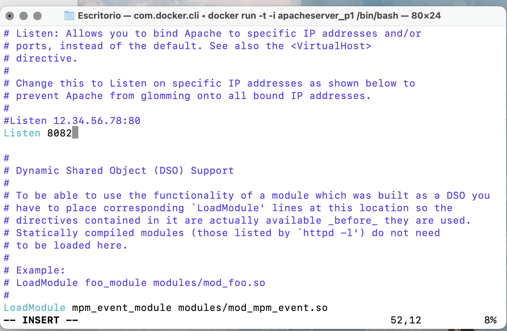
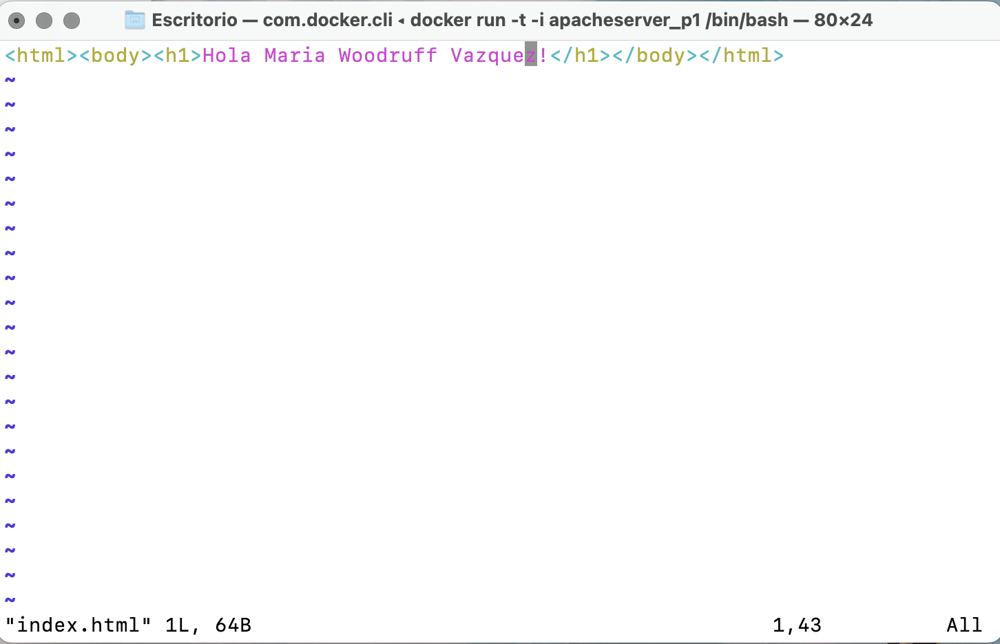

# Práctica 1 Docker

## Primero creo el docker:
Creo una carpeta llamada docker en el escritorio.

Creo un archivo Dockerfile:
```console
touch Dockerfile
```

Escribo dentro con:
```console
vim Dockerfile
```

Escribo dentro:
```console
FROM ubuntu:latest
RUN apt-get update && apt-get install -y apache2
EXPOSE 80
CMD ["apachectl", "-D", "FOREGROUND"]
```

Construyo el docker:
```console
docker build -t apacheserver_p1
```

Lo ejecuto:
```console
docker run -p 80:80 apacheserver_p1
```

Compruebo que funciona en: http://localhost

## Lo subo a Docker Hub

compruebo que he iniciado sesión:
```console
sudo docker login
```

```console
sudo docker apacheserver_p1 mariawv0802/apacheserver_p1:latest
sudo docker push mariawv0802/apacheserver_p1:latest
```

## Cambio el puerto

Ejecuto el docker usando la terminal de dentro:

```console
sudo docker run -t -i mariawv0802/apacheserver_p1 /bin/bash
```

Instalo vim para poder editar los ficheros:
```console
apt-get update
apt-get install vim
```

Busco el archivo donde modificar el puerto:
```console
sudo -i
cd /etc/apache2
vim ports.conf
```

Cambio Listen 80 por 8082.



## Cambio el html

Busco el archivo donde modificar el html:

```console
vim /var/www/html/index.html
```

Dentro escribo:
```html
<h1> Hola Maria Woodruff Vazquez! </h1>
```



Escribo en el navegador: localhost:8082

## Subo a DockerHub la nueva versión

```console
docker tag apacheserver_p1:v3 mariawv0802/apacheserver_p1
docker push mariawv0802/apacheserver_p1:v3
```

Lo ejecuto:
```console
sudo docker run -d -p 8082 mariawv0802/apacheserver_p1
```

Con el comando docker ps veo en qué puerto se ejecuta dentro de mi máquina local, por ejemplo 49404. Se ve en el apartado PORTS.
```console
0.0.0.0:49404->8082/tcp
```
Abro el localhost: http://localhost:49404/


# Enlace a mi docker:

https://hub.docker.com/repository/docker/mariawv0802/apacheserver_p1/general

