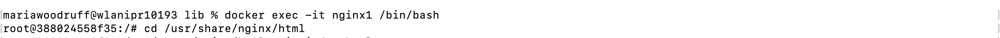
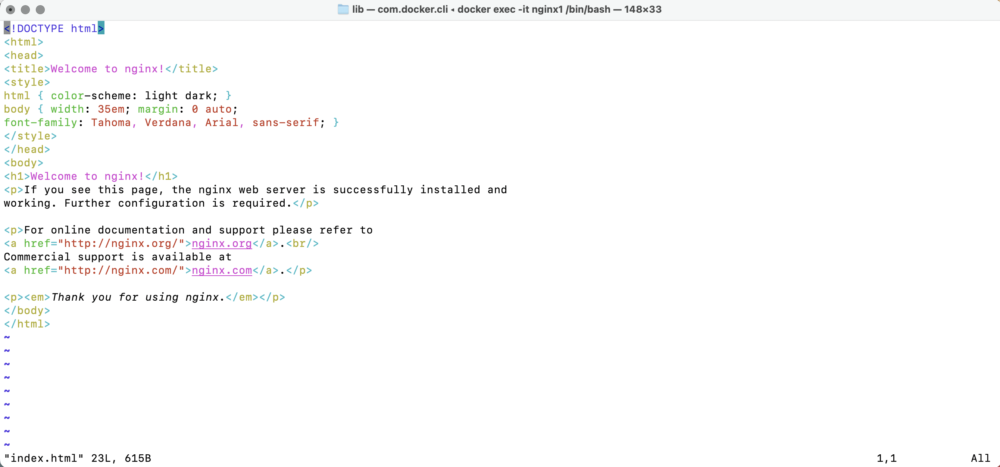
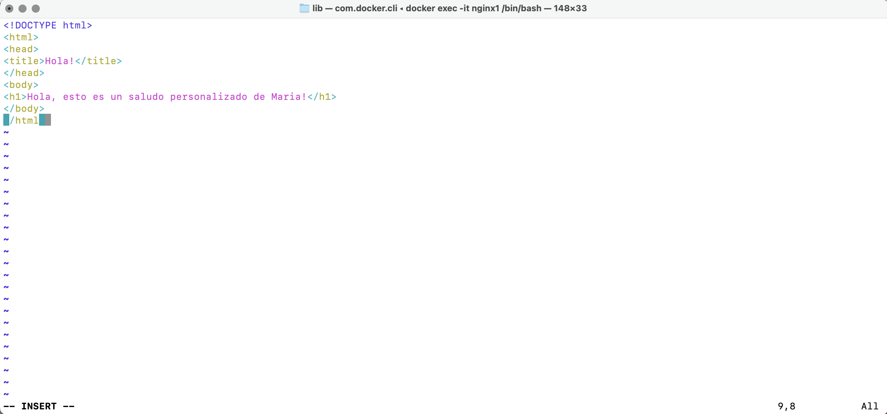
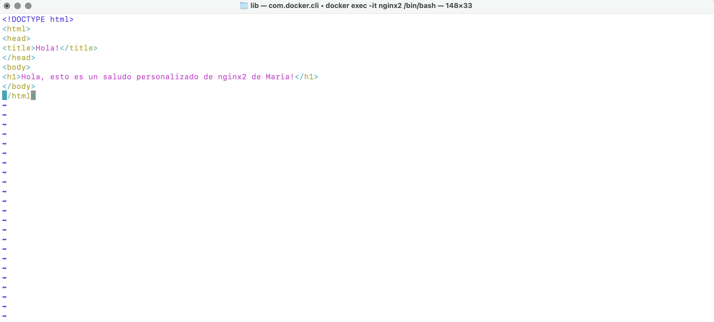
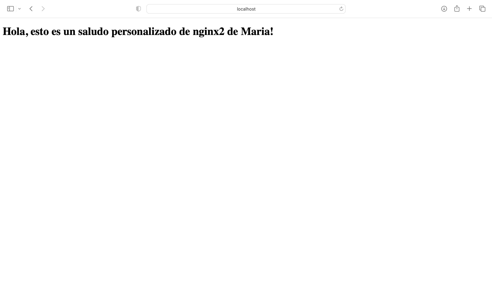
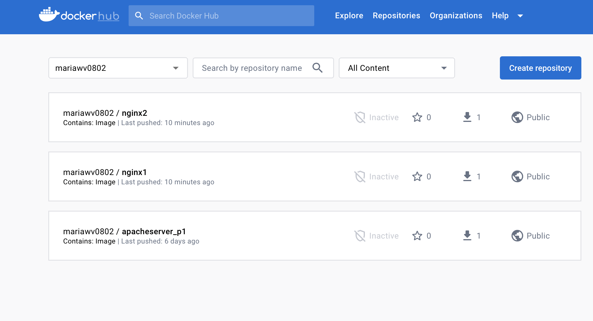
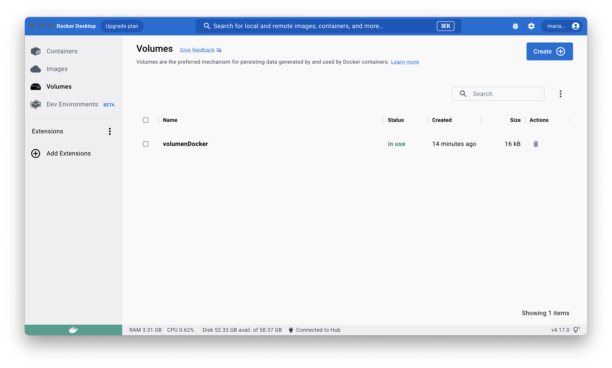
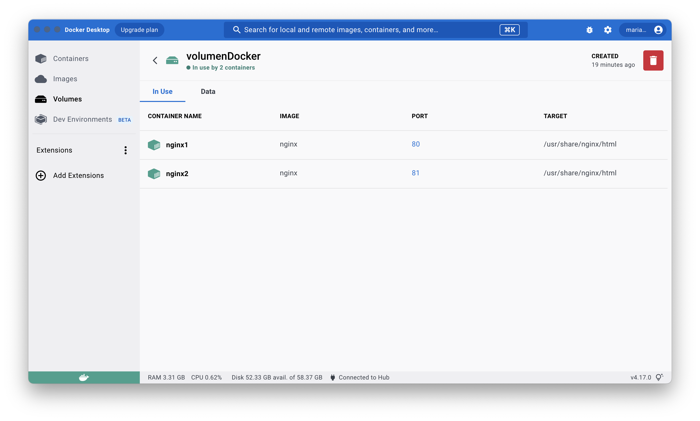

+ Creo el volumen volumenDocker
```bash
docker volume create volumenDocker
```

+ Libero el puerto 80, porque si no no me deja construir el contenedor
```bash
sudo kill -9 $(sudo lsof -t -i :80)
```

+ Creo el contenedor nginx1
```bash
docker run -d -p 80:80 -v volumenDocker:/usr/share/nginx/html --name nginx1 nginx
```



```bash
docker exec -it nginx1 /bin/bash  
cd /usr/share/nginx/html
apt-get update
apt-get install vim
vim index.html
```

+ Inicialmente veo:


+ Modifico index.html para crear un mensaje personalizado



```bash
exit
```

+ Creo el otro contenedor nginx2
```bash
docker run -d -p 81:80 -v volumenDocker:/usr/share/nginx/html --name nginx2 nginx
```

+ Repito los pasos para acceder a index.html
```bash
docker exec -it nginx2 /bin/bash 
cd /usr/share/nginx/html
apt-get update
apt-get install vim
vim index.html
```

+ Ahora en index.html me sale el mensaje personalizado de nginx1 porque lo he creado a partir de él. Lo modifico y salgo con exit.



+ Compruebo localhost:81




# Subo los contenedores a dockerHub

```bash
docker commit nginx1 mariawv0802/nginx1
docker commit nginx2 mariawv0802/nginx2

docker tag mariawv0802/nginx1 mariawv0802/nginx1:v1.0
docker tag mariawv0802/nginx2 mariawv0802/nginx2:v1.0

docker push mariawv0802/nginx1:v1.0
docker push mariawv0802/nginx2:v1.0
```

En mi dockerHub están subidas las imágenes: https://hub.docker.com



Foto del volumen:





