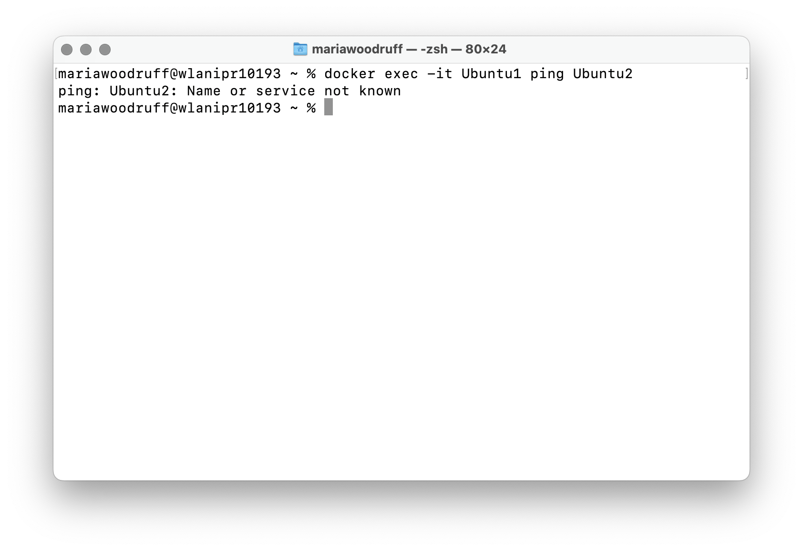
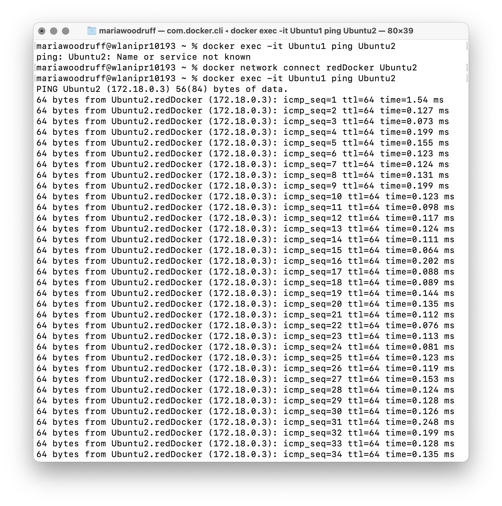
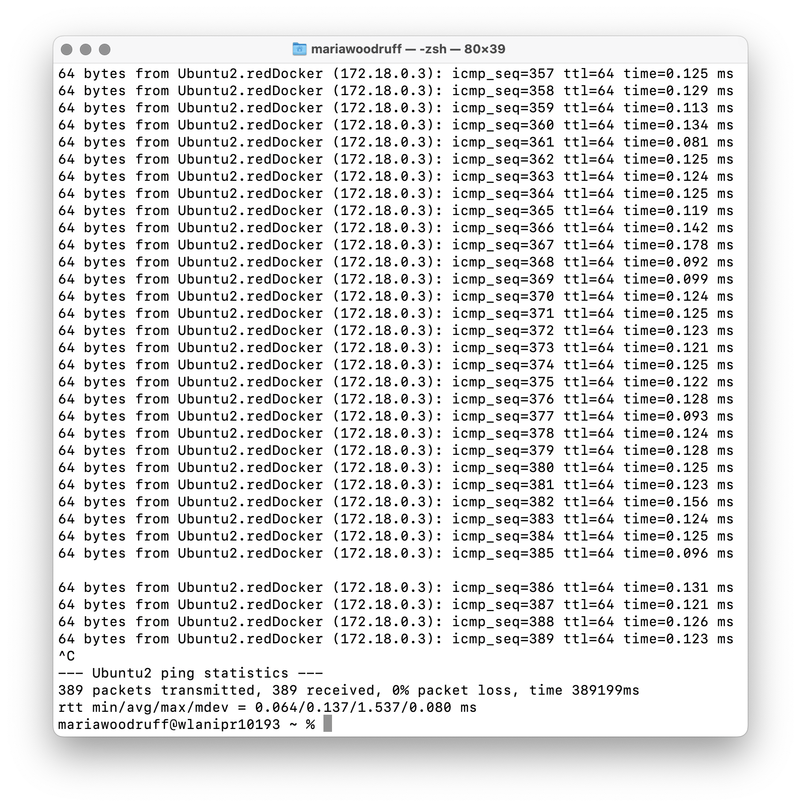

# Práctica 2

## redDocker

Creo una nueva red redDocker.
```console
docker network create redDocker
```

Compruebo que se ha creado.
```console
docker network ls
```

## Contenedores

Creo el contenedor Ubuntu1
```console
docker run -it --name Ubuntu1 ubuntu
```

Nada más crearlo, entra automáticamente en el bash. Abro otra terminal y conecto el contenedor a la red redDocker.
```console
docker network connect redDocker Ubuntu1
```

Abro otra terminal y creo el contenedor Ubuntu2
```console
docker run -it --name Ubuntu2 ubuntu
```

Instalo el comando ping en Ubuntu1 y Ubuntu2. Dentro del root de cada máquina escribo:
```console
apt-get update && apt-get install -y iputils-ping
```

Hago ping de Ubuntu1 a Ubuntu2 estando sólo Ubuntu1 conectada a redDocker.
```console
docker exec -it Ubuntu1 ping Ubuntu2
```



Ha fallado porque no están conectados a la misma red. El mensaje de error dice que no reconoce el nombre porque no están conectados a la misma red.

Conecto Ubuntu2 a la red redDocker.
```console
docker network connect redDocker Ubuntu2
```



Ahora se realiza el ping ya que están conectados a la misma red. Hago control+C y termino su ejecución.



## Subir a DockerHub

Subo Ubuntu1 y Ubuntu2 a DockerHub

```console
docker commit Ubuntu1 mariawv0802/ubuntu1:latest
docker push mariawv0802/ubuntu1:latest

docker commit Ubuntu2 mariawv0802/ubuntu2:latest
docker push mariawv0802/ubuntu2:latest
```

En mi DockerHub ahora aparecen ubuntu1 y ubuntu2:
https://hub.docker.com/repository/docker/mariawv0802/ubuntu1/general
https://hub.docker.com/repository/docker/mariawv0802/ubuntu2/general

