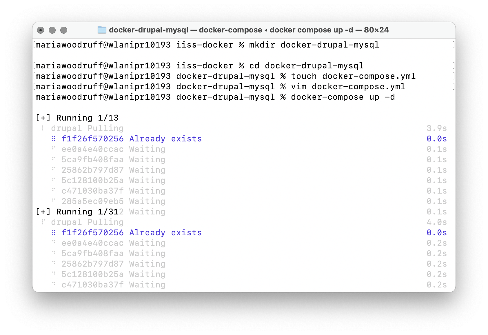
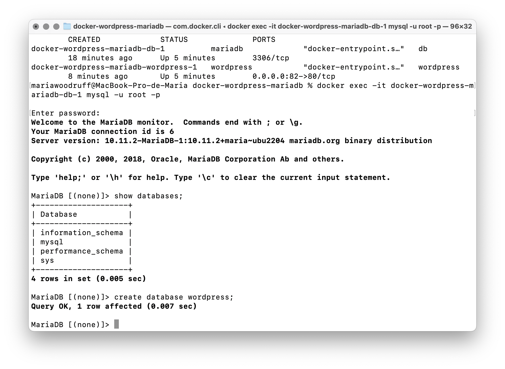
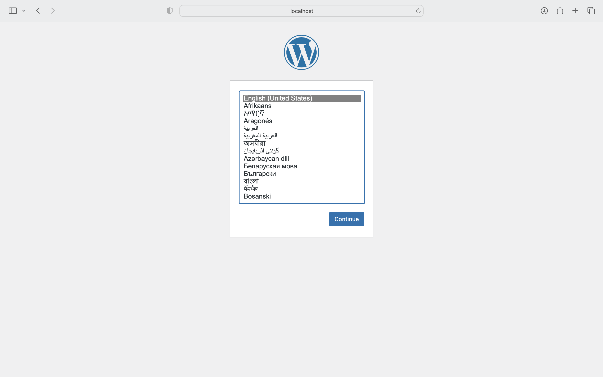

# Práctica 3

## Parte 1

Prear un fichero docker-compose.yml con dos servicios: drupal + mysql, primero creo un directorio llamado docker-drupal-mysql. Entro en el directorio
y creo un archivo docker-compose.yml. Lo edito con vim.

```console
mkdir docker-drupal-mysql
cd docker-drupal-mysql
touch docker-compose.yml
vim docker-compose.yml
```

En este archivo de docker-compose.yml, he definido dos servicios, uno para MySQL y otro para Drupal.He especificado que los contenedores usen el volumen
volumenDocker. Para hacer que el servicio de Drupal use el puerto 81, hemos especificado la opción "ports"
y mapeado el puerto 80 del contenedor al puerto 81 del host. Para que el servicio de Drupal pueda acceder a la base de datos de MySQL,
he especificado las variables de entorno necesarias en el servicio de Drupal. Estas variables indican el host y el puerto de la base de datos,
el nombre de la base de datos, el nombre de usuario y la contraseña.


Ejecuto los contenedores

```console
docker-compose up -d
```




Compruebo en http://localhost:81


## Parte 2

Prear un fichero docker-compose.yml con dos servicios: wordpress + mariadb, primero creo un directorio llamado docker-wordpress-mariadb. Entro en el directorio y creo un archivo docker-compose.yml. Lo edito con vim.

```console
mkdir docker-wordpress-mariadb
cd docker-wordpress-mariadb
touch docker-compose.yml
vim docker-compose.yml
```

En este archivo de docker-compose.yml, he definido dos servicios, uno para wordpress y otro para mariadb.He especificado que los contenedores usen la red redDocker. Para hacer que el servicio de wordpress use el puerto 82, hemos especificado la opción "ports" y mapeado el puerto 80 del contenedor al puerto 2  del host.


Ejecuto los contenedores

```console
docker-compose up -d
```

Compruebo en http://localhost:82

Me daba un error porque al entrar en localhost:82 aparecía: Error establishing a database connection. Lo solucioné entrando en la base de datos viendo con docker-compose ps que se llamaba docker-wordpress-mariadb-db-1. Ejecuté docker exec -it docker-wordpress-mariadb-db-1 mysql -u root -p e introduje la contraseña de docker-compose.yml que es example. Vi las bases de datos con show databases, y como no aparecía la base de datos wordpress, la añadí con create database wordpress y ya funcionaba en localhost:82.
```console
docker-compose ps
docker exec -it docker-wordpress-mariadb-db-1 mysql -u root -p
show databases;
create database wordpress;
```



Finalmente, funciona.



